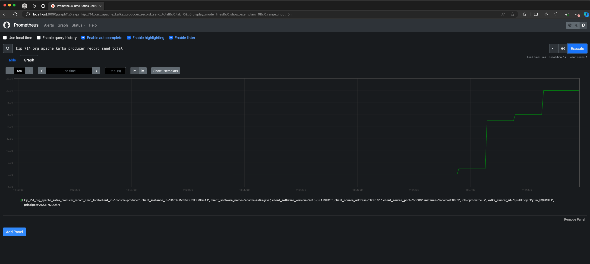

<!-- title: How to centrally monitor Kafka clients via broker configuration -->
<!-- description: In this tutorial, learn how to centrally monitor Kafka clients via broker configuration (using KIP-714). -->

# How to centrally monitor Kafka clients via broker configuration

Kafka's [KIP-714](https://cwiki.apache.org/confluence/display/KAFKA/KIP-714%3A+Client+metrics+and+observability)
introduced in Apache Kafka 3.7 adds new capability that allows the Kafka broker to centrally track client
metrics on behalf of applications. The broker can subsequently relay these metrics to a remote monitoring
system, facilitating the effective monitoring of Kafka client health and the identification of any problems.

The broker requires a Metrics Reporter plugin which implements the `ClientTelemetry` interface to
send client metrics to a remote monitoring system. This tutorial demonstrates how to use the plugin
to monitor Kafka clients.

This tutorial adds `ClientOtlpMetricsReporter` that aggregates [OpenTelemetry Protocol](https://opentelemetry.io/docs/specs/otel/protocol/) (OTLP) metrics
received from client, enhances them with additional client labels and forwards them via gRPC client
to an external OTLP receiver. The OTLP receiver can be any OpenTelemetry compatible backend like
Prometheus, Jaeger, Zipkin, etc. The plugin is implemented in Java and requires the jar to be
added to the Kafka broker libs.

The OTLP receiver for the tutorial is [otel-collector](https://opentelemetry.io/docs/collector/), which is a part of the OpenTelemetry project.
The `otel-collector` receives the metrics from the Kafka broker and forwards them to a Prometheus
instance for visualization.

## Prerequisites

* Java 17 or higher, e.g., follow the OpenJDK installation instructions [here](https://openjdk.org/install/) if you don't have Java.
* Docker running via [Docker Desktop](https://docs.docker.com/desktop/) or [Docker Engine](https://docs.docker.com/engine/install/)

## Setup and Cleanup
- [Start OpenTelemetry Collector and Prometheus](#start-opentelemetry-collector-and-prometheus)
- [Build Client Telemetry Reporter Plugin jar](#build-the-client-telemetry-reporter-plugin)
- [Download and Setup Apache Kafka Broker](#apache-kafka-broker)
- [Start Apache Kafka Client 3.7.0 or higher](#create-a-kafka-client)
- [Cleanup](#cleanup)

### Start OpenTelemetry Collector and Prometheus

Clone the [confluentinc/tutorials](https://github.com/confluentinc/tutorials) GitHub repository
(if you haven't already), navigate to the tutorials directory, and start the OpenTelemetry collector and Prometheus:

```shell
git clone git@github.com:confluentinc/tutorials.git
cd tutorials
docker compose -f ./client-telemetry-reporter-plugin/kafka/docker-compose.yml up -d
```

In this example, we've configured the OTel collector (in `client-telemetry-reporter-plugin/kafka/otel-collector-config.yaml`)
to receive OTLP metrics from the Kafka broker via gRPC on port 4317 and forwards them to `Prometheus` on port 8889.
The configuration adds a namespace `kip-714` to the metrics, which means that the metrics in Prometheus
will all start with `kip_714_`, and can be used to identify the source of the metrics.
The configuration also enables resource to telemetry conversion to add labels to the metrics.

### Build the client-telemetry-reporter-plugin

Build the `client-telemetry-reporter-plugin` JAR.

```shell
./gradlew clean :client-telemetry-reporter-plugin:kafka:build
```

The above command builds the `client-telemetry-reporter-plugin` JAR located at:
`client-telemetry-reporter-plugin/kafka/build/libs/client-telemetry-reporter-plugin.jar`

### Apache Kafka Broker

Download the Apache Kafka 3.8.0 or higher release from [here](https://kafka.apache.org/downloads).
Any version of Kafka 3.7.0 or higher will work for client metrics but the plugin is written for Kafka 3.8.0 or higher.

```shell
wget https://downloads.apache.org/kafka/3.8.0/kafka_2.13-3.8.0.tgz
tar -xvf kafka_2.13-3.8.0.tgz
cd kafka_2.13-3.8.0
```

The `pwd` directory is referred to as `<kafka_path>` in the rest of the tutorial.

#### Add the client-telemetry-reporter-plugin to the Kafka Broker

Copy the `client-telemetry-reporter-plugin.jar` to the Kafka broker `libs` directory.

```shell
cp <tutorials_repo_path>/tutorials/client-telemetry-reporter-plugin/kafka/build/libs/client-telemetry-reporter-plugin.jar <kafka_path>/libs/
```

#### Configure the Kafka Broker

Add the following configuration to the Kafka broker `kraft` properties file `server.properties`,
located at `<kafka_path>/kafka_2.13-3.8.0/config/kraft/server.properties`.

```properties
# Add the client telemetry reporter plugin
metric.reporters=io.confluent.developer.ClientOtlpMetricsReporter
```

#### Start the Kafka Broker

```shell
KAFKA_CLUSTER_ID="$(bin/kafka-storage.sh random-uuid)"
./bin/kafka-storage.sh format -t $KAFKA_CLUSTER_ID -c config/kraft/server.properties
OTEL_EXPORTER_OTLP_ENDPOINT=127.0.0.1:4317 ./bin/kafka-server-start.sh config/kraft/server.properties
```

#### Create metrics subscription

Create a metrics subscription to receive client metrics from the Kafka broker.

```shell
./bin/kafka-client-metrics.sh --bootstrap-server localhost:9092 --alter --name <subscription_name> --metrics <metric_name_prefix> --interval <interval_ms>
```

##### Examples:
The below command subscribes to all the metrics starting with (prefix match) `org.apache.kafka.producer.record`
with an interval of 10 seconds.

```shell
./bin/kafka-client-metrics.sh --bootstrap-server localhost:9092 --alter --name producer-record-metrics --metrics "org.apache.kafka.producer.record" --interval 10000
```

The below command subscribes to all the metrics with an interval of 10 seconds.

```shell
./bin/kafka-client-metrics.sh --bootstrap-server localhost:9092 --alter --name all-metrics --metrics "*" --interval 10000
```

### Create a Kafka Client

Create a Kafka client that sends metrics to the broker. The client should be using the Kafka client
version 3.7.0 or higher.

#### Start console producer

```shell
./bin/kafka-console-producer.sh --broker-list localhost:9092 --topic test
```

### Access Client Metrics

Produce messages to the topic `test` and observe the metrics in the Prometheus instance. Prometheus
can be accessed at `http://localhost:9090`. The metrics shall appear prefixed with `kip_714` namespace.



Following log line indicates that the metrics are being sent by the plugin to the gRPC endpoint:

```
[grpc-default-executor-0] INFO io.confluent.developer.ClientOtlpMetricsReporter - Successfully exported metrics request to 127.0.0.1:4317
```

### Cleanup

Stop the Kafka broker, either by pressing `Ctrl+C` in the terminal where the broker is running or by running
the following command from the Kafka directory:

```shell
./bin/kafka-server-stop.sh
```

Stop the OpenTelemetry Collector and Prometheus containers by running the following command from the tutorials directory:

```shell
docker compose -f ./client-telemetry-reporter-plugin/kafka/docker-compose.yml down
```